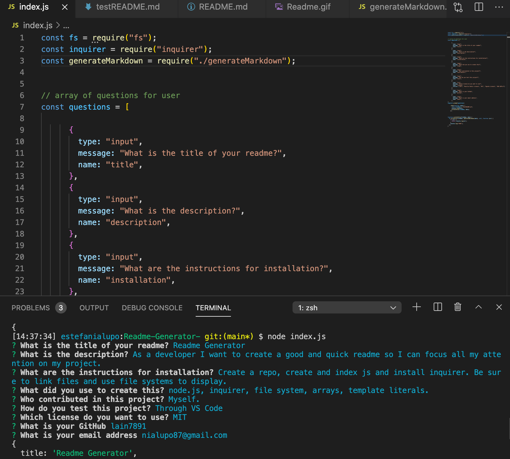

# Readme-Generator-

For this assignment we were to create a readme generator. Why is this incredibly useful?  A good readme is important to help other developers navigate through your app or website. 
As a developer you want to spend the bulk of your time focusing on your current project. The readme generator gives developers the ability to create good quality readme’s in no time. 

## Table of Content

* [Installation](#installation) 
* [Usage](#usage) 
* [Credits](#credits) 
* [License](#license) 

## Installation

* Created a git repository
* Created an index.js file, testREADME.md and linked it to the getMarkdown.js file provided to us. 

## Usage

* Node.js
* Variable Created (specifically CONST)
* Console logging
* Inquirer (had to install)
* Template Literals
* Badges
* Files Systems

## Credits

Created by myself as a homework assignment for Georgia Tech Full-Stack Flex Program.

## License

MIT License

Copyright (c) [2020] [Estefania Lupo]

Permission is hereby granted, free of charge, to any person obtaining a copy
of this software and associated documentation files (the "Software"), to deal
in the Software without restriction, including without limitation the rights
to use, copy, modify, merge, publish, distribute, sublicense, and/or sell
copies of the Software, and to permit persons to whom the Software is
furnished to do so, subject to the following conditions:

The above copyright notice and this permission notice shall be included in all
copies or substantial portions of the Software.

THE SOFTWARE IS PROVIDED "AS IS", WITHOUT WARRANTY OF ANY KIND, EXPRESS OR
IMPLIED, INCLUDING BUT NOT LIMITED TO THE WARRANTIES OF MERCHANTABILITY,
FITNESS FOR A PARTICULAR PURPOSE AND NONINFRINGEMENT. IN NO EVENT SHALL THE
AUTHORS OR COPYRIGHT HOLDERS BE LIABLE FOR ANY CLAIM, DAMAGES OR OTHER
LIABILITY, WHETHER IN AN ACTION OF CONTRACT, TORT OR OTHERWISE, ARISING FROM,
OUT OF OR IN CONNECTION WITH THE SOFTWARE OR THE USE OR OTHER DEALINGS IN THE
SOFTWARE.

